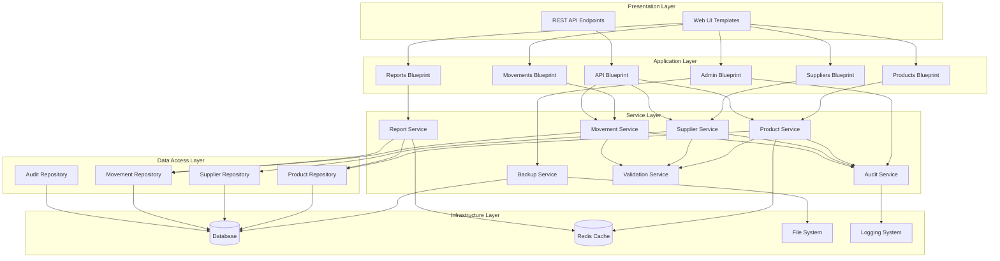

# Design Document: System Audit and Improvements

## Overview

This design document outlines the comprehensive refactoring and enhancement of the Flask-based inventory management system. The design addresses critical security vulnerabilities, eliminates code duplication, implements industry best practices, and adds essential missing functionality to transform the system into a production-ready application.

The design follows a modular architecture with clear separation of concerns, implementing the following key patterns:
- **Blueprint-based routing** for modular organization
- **Service layer pattern** for business logic separation
- **Repository pattern** for data access abstraction
- **Dependency injection** for testability
- **Factory pattern** for application configuration
- **Decorator pattern** for cross-cutting concerns (logging, caching, rate limiting)

## Architecture

### High-Level Architecture



### Directory Structure

```
inventory_system/
├── app/
│   ├── __init__.py              # Application factory
│   ├── config.py                # Configuration classes
│   ├── extensions.py            # Flask extensions initialization
│   ├── blueprints/              # Route blueprints
│   │   ├── __init__.py
│   │   ├── products.py
│   │   ├── suppliers.py
│   │   ├── movements.py
│   │   ├── reports.py
│   │   ├── admin.py
│   │   └── api/
│   │       ├── __init__.py
│   │       ├── v1/
│   │       │   ├── products.py
│   │       │   ├── suppliers.py
│   │       │   └── movements.py
│   ├── services/                # Business logic layer
│   │   ├── __init__.py
│   │   ├── product_service.py
│   │   ├── supplier_service.py
│   │   ├── movement_service.py
│   │   ├── report_service.py
│   │   ├── audit_service.py
│   │   ├── backup_service.py
│   │   └── validation_service.py
│   ├── repositories/            # Data access layer
│   │   ├── __init__.py
│   │   ├── base_repository.py
│   │   ├── product_repository.py
│   │   ├── supplier_repository.py
│   │   ├── movement_repository.py
│   │   └── audit_repository.py
│   ├── models/                  # Database models
│   │   ├── __init__.py
│   │   ├── product.py
│   │   ├── supplier.py
│   │   ├── movement.py
│   │   ├── user.py
│   │   ├── audit_log.py
│   │   └── configuration.py
│   ├── schemas/                 # Validation schemas
│   │   ├── __init__.py
│   │   ├── product_schema.py
│   │   ├── supplier_schema.py
│   │   └── movement_schema.py
│   ├── utils/                   # Utility functions
│   │   ├── __init__.py
│   │   ├── decorators.py
│   │   ├── validators.py
│   │   ├── formatters.py
│   │   └── security.py
│   ├── middleware/              # Custom middleware
│   │   ├── __init__.py
│   │   ├── error_handlers.py
│   │   ├── rate_limiter.py
│   │   └── request_logger.py
│   └── templates/               # Jinja2 templates
│       ├── base.html
│       ├── products/
│       ├── suppliers/
│       ├── movements/
│       ├── reports/
│       └── admin/
├── tests/                       # Test suite
│   ├── unit/
│   ├── integration/
│   ├── property/
│   └── fixtures/
├── migrations/                  # Database migrations
├── docs/                        # Documentation
├── scripts/                     # Utility scripts
├── .env.example                 # Environment template
├── requirements.txt             # Dependencies
└── wsgi.py                      # WSGI entry point
```

## Components and Interfaces

### 1. Application Factory

**Purpose:** Create and configure Flask application instances with environment-specific settings.

**Interface:**
```python
def create_app(config_name: str = 'development') -> Flask:
    """
    Create and configure Flask application.
    
    Args:
        config_name: Configuration environment (development, testing, production)
        
    Returns:
        Configured Flask application instance
    """
```

**Responsibilities:**
- Load configuration from environment
- Initialize Flask extensions (SQLAlchemy, Migrate, Login Manager, etc.)
- Register blueprints
- Configure error handlers
- Set up logging
- Initialize middleware

### 2. Configuration Manager

**Purpose:** Manage environment-specific configuration with validation.

**Interface:**
```python
class Config:
    """Base configuration class"""
    SECRET_KEY: str
    SQLALCHEMY_DATABASE_URI: str
    SQLALCHEMY_TRACK_MODIFICATIONS: bool = False
    
class DevelopmentConfig(Config):
    """Development environment configuration"""
    DEBUG: bool = True
    
class ProductionConfig(Config):
    """Production environment configuration"""
    DEBUG: bool = False
    
class TestingConfig(Config):
    """Testing environment configuration"""
    TESTING: bool = True
```

### 3. Service Layer

#### Product Service

**Purpose:** Manage product business logic including creation, updates, code generation, and validation.

**Interface:**
```python
class ProductService:
    def __init__(self, repository: ProductRepository, 
                 validation_service: ValidationService,
                 audit_service: AuditService):
        """Initialize product service with dependencies"""
        
    def create_product(self, data: Dict[str, Any], user_id: int) -> Result[Product, ValidationError]:
        """Create new product with validation and audit logging"""
        
    def update_product(self, product_id: int, data: Dict[str, Any], user_id: int) -> Result[Product, ValidationError]:
        """Update existing product with validation and audit logging"""
        
    def delete_product(self, product_id: int, user_id: int) -> Result[bool, Error]:
        """Soft delete product with audit logging"""
        
    def get_product(self, product_id: int) -> Optional[Product]:
        """Retrieve product by ID"""
        
    def search_products(self, query: str, filters: Dict[str, Any], 
                       page: int = 1, per_page: int = 20) -> PaginatedResult[Product]:
        """Search products with pagination"""
        
    def generate_product_code(self, category: str, description: str) -> Result[str, ValidationError]:
        """Generate unique product code"""
        
    def import_from_excel(self, file_path: str, user_id: int) -> ImportResult:
        """Import products from Excel file with validation"""
```

#### Supplier Service

**Purpose:** Manage supplier operations including CRUD operations and validation.

**Interface:**
```python
class SupplierService:
    def __init__(self, repository: SupplierRepository,
                 validation_service: ValidationService,
                 audit_service: AuditService):
        """Initialize supplier service with dependencies"""
        
    def create_supplier(self, data: Dict[str, Any], user_id: int) -> Result[Supplier, ValidationError]:
        """Create new supplier with RIF validation"""
        
    def update_supplier(self, supplier_id: int, data: Dict[str, Any], user_id: int) -> Result[Supplier, ValidationError]:
        """Update existing supplier"""
        
    def get_supplier(self, supplier_id: int) -> Optional[Supplier]:
        """Retrieve supplier by ID"""
        
    def list_suppliers(self, page: int = 1, per_page: int = 20) -> PaginatedResult[Supplier]:
        """List all suppliers with pagination"""
```

#### Movement Service

**Purpose:** Manage inventory movements with stock validation and transaction management.

**Interface:**
```python
class MovementService:
    def __init__(self, repository: MovementRepository,
                 product_repository: ProductRepository,
                 validation_service: ValidationService,
                 audit_service: AuditService):
        """Initialize movement service with dependencies"""
        
    def create_movement(self, data: Dict[str, Any], user_id: int) -> Result[Movement, ValidationError]:
        """Create movement with stock validation and update"""
        
    def get_movements_by_date(self, date: datetime.date, 
                             page: int = 1, per_page: int = 50) -> PaginatedResult[Movement]:
        """Retrieve movements for specific date"""
        
    def close_day(self, date: datetime.date, user_id: int) -> Result[CierreDia, Error]:
        """Close day and mark movements as final"""
        
    def get_movement_history(self, product_id: int, 
                            start_date: datetime.date,
                            end_date: datetime.date) -> List[Movement]:
        """Get movement history for product"""
```

#### Audit Service

**Purpose:** Track all system changes for compliance and debugging.

**Interface:**
```python
class AuditService:
    def __init__(self, repository: AuditRepository):
        """Initialize audit service"""
        
    def log_action(self, user_id: int, action: str, entity_type: str,
                  entity_id: int, old_values: Optional[Dict] = None,
                  new_values: Optional[Dict] = None) -> AuditLog:
        """Log user action with before/after values"""
        
    def search_audit_logs(self, filters: Dict[str, Any],
                         page: int = 1, per_page: int = 50) -> PaginatedResult[AuditLog]:
        """Search audit logs with filters"""
        
    def export_audit_logs(self, start_date: datetime.date,
                         end_date: datetime.date, format: str = 'csv') -> str:
        """Export audit logs for compliance reporting"""
```

#### Backup Service

**Purpose:** Manage database backups and restoration.

**Interface:**
```python
class BackupService:
    def __init__(self, db_uri: str, backup_dir: str):
        """Initialize backup service"""
        
    def create_backup(self, backup_name: Optional[str] = None) -> Result[BackupInfo, Error]:
        """Create database backup with compression"""
        
    def restore_backup(self, backup_name: str, create_pre_restore_backup: bool = True) -> Result[bool, Error]:
        """Restore database from backup"""
        
    def list_backups(self) -> List[BackupInfo]:
        """List available backups with metadata"""
        
    def delete_old_backups(self, retention_days: int = 30) -> int:
        """Delete backups older than retention period"""
        
    def verify_backup(self, backup_name: str) -> Result[bool, Error]:
        """Verify backup integrity"""
```

#### Validation Service

**Purpose:** Centralized input validation and sanitization.

**Interface:**
```python
class ValidationService:
    def validate_product_data(self, data: Dict[str, Any]) -> Result[Dict[str, Any], ValidationError]:
        """Validate product data"""
        
    def validate_supplier_data(self, data: Dict[str, Any]) -> Result[Dict[str, Any], ValidationError]:
        """Validate supplier data including RIF format"""
        
    def validate_movement_data(self, data: Dict[str, Any]) -> Result[Dict[str, Any], ValidationError]:
        """Validate movement data"""
        
    def validate_file_upload(self, file: FileStorage) -> Result[bool, ValidationError]:
        """Validate uploaded file (type, size, content)"""
        
    def sanitize_string(self, value: str) -> str:
        """Sanitize string input to prevent XSS"""
        
    def validate_product_code(self, code: str) -> Result[bool, ValidationError]:
        """Validate product code format"""
```

### 4. Repository Layer

#### Base Repository

**Purpose:** Provide common data access patterns for all repositories.

**Interface:**
```python
class BaseRepository(Generic[T]):
    def __init__(self, model: Type[T], db: SQLAlchemy):
        """Initialize repository with model and database"""
        
    def get_by_id(self, id: int) -> Optional[T]:
        """Get entity by ID"""
        
    def get_all(self, page: int = 1, per_page: int = 20) -> PaginatedResult[T]:
        """Get all entities with pagination"""
        
    def create(self, entity: T) -> T:
        """Create new entity"""
        
    def update(self, entity: T) -> T:
        """Update existing entity"""
        
    def delete(self, entity: T) -> bool:
        """Delete entity"""
        
    def filter_by(self, **kwargs) -> List[T]:
        """Filter entities by criteria"""
```

### 5. Security Components

#### Authentication & Authorization

**Components:**
- Flask-Login for session management
- Bcrypt for password hashing (work factor 12)
- JWT tokens for API authentication
- Role-based access control (RBAC)

**Interface:**
```python
class SecurityService:
    def hash_password(self, password: str) -> str:
        """Hash password using bcrypt"""
        
    def verify_password(self, password: str, hashed: str) -> bool:
        """Verify password against hash"""
        
    def generate_jwt_token(self, user_id: int, expires_in: int = 3600) -> str:
        """Generate JWT token for API authentication"""
        
    def verify_jwt_token(self, token: str) -> Optional[int]:
        """Verify JWT token and return user ID"""
        
    def check_permission(self, user: User, resource: str, action: str) -> bool:
        """Check if user has permission for action on resource"""
```

#### Rate Limiting

**Implementation:** Flask-Limiter with Redis backend

**Configuration:**
```python
RATELIMIT_STORAGE_URL = "redis://localhost:6379"
RATELIMIT_DEFAULT = "100 per minute"
RATELIMIT_LOGIN = "5 per minute"
```

#### CSRF Protection

**Implementation:** Flask-WTF CSRF protection enabled globally

### 6. Error Handling

**Global Error Handlers:**
```python
@app.errorhandler(400)
def bad_request(error):
    """Handle bad request errors"""
    
@app.errorhandler(401)
def unauthorized(error):
    """Handle unauthorized errors"""
    
@app.errorhandler(403)
def forbidden(error):
    """Handle forbidden errors"""
    
@app.errorhandler(404)
def not_found(error):
    """Handle not found errors"""
    
@app.errorhandler(500)
def internal_error(error):
    """Handle internal server errors"""
    
@app.errorhandler(Exception)
def handle_exception(error):
    """Handle all unhandled exceptions"""
```

### 7. Logging System

**Configuration:**
```python
LOGGING_CONFIG = {
    'version': 1,
    'formatters': {
        'default': {
            'format': '[%(asctime)s] %(levelname)s in %(module)s: %(message)s',
        },
        'detailed': {
            'format': '[%(asctime)s] %(levelname)s [%(name)s.%(funcName)s:%(lineno)d] %(message)s',
        }
    },
    'handlers': {
        'console': {
            'class': 'logging.StreamHandler',
            'formatter': 'default',
            'level': 'INFO',
        },
        'file': {
            'class': 'logging.handlers.RotatingFileHandler',
            'filename': 'logs/app.log',
            'maxBytes': 10485760,  # 10MB
            'backupCount': 10,
            'formatter': 'detailed',
            'level': 'DEBUG',
        },
        'error_file': {
            'class': 'logging.handlers.RotatingFileHandler',
            'filename': 'logs/error.log',
            'maxBytes': 10485760,
            'backupCount': 10,
            'formatter': 'detailed',
            'level': 'ERROR',
        }
    },
    'root': {
        'level': 'INFO',
        'handlers': ['console', 'file', 'error_file']
    }
}
```

## Data Models

### Enhanced Product Model

```python
class Product(db.Model):
    __tablename__ = 'products'
    
    id = db.Column(db.Integer, primary_key=True)
    codigo = db.Column(db.String(50), unique=True, nullable=False, index=True)
    descripcion = db.Column(db.String(200), nullable=False, index=True)
    stock = db.Column(db.Integer, default=0, nullable=False)
    precio_dolares = db.Column(db.Numeric(10, 2), default=0.0, nullable=False)
    factor_ajuste = db.Column(db.Numeric(5, 2), default=1.0, nullable=False)
    proveedor_id = db.Column(db.Integer, db.ForeignKey('suppliers.id'), index=True)
    
    # Audit fields
    created_at = db.Column(db.DateTime, default=datetime.utcnow, nullable=False)
    updated_at = db.Column(db.DateTime, default=datetime.utcnow, onupdate=datetime.utcnow, nullable=False)
    created_by = db.Column(db.Integer, db.ForeignKey('users.id'))
    updated_by = db.Column(db.Integer, db.ForeignKey('users.id'))
    deleted_at = db.Column(db.DateTime, nullable=True)  # Soft delete
    
    # Relationships
    proveedor = db.relationship('Supplier', backref='products')
    movimientos = db.relationship('Movement', backref='producto', lazy='dynamic')
    
    # Constraints
    __table_args__ = (
        db.CheckConstraint('stock >= 0', name='check_stock_positive'),
        db.CheckConstraint('precio_dolares >= 0', name='check_price_positive'),
    )
```

### Audit Log Model

```python
class AuditLog(db.Model):
    __tablename__ = 'audit_logs'
    
    id = db.Column(db.Integer, primary_key=True)
    user_id = db.Column(db.Integer, db.ForeignKey('users.id'), nullable=False, index=True)
    action = db.Column(db.String(50), nullable=False, index=True)  # CREATE, UPDATE, DELETE, LOGIN, etc.
    entity_type = db.Column(db.String(50), nullable=False, index=True)  # Product, Supplier, Movement, etc.
    entity_id = db.Column(db.Integer, nullable=False, index=True)
    old_values = db.Column(db.JSON, nullable=True)
    new_values = db.Column(db.JSON, nullable=True)
    ip_address = db.Column(db.String(45), nullable=True)
    user_agent = db.Column(db.String(255), nullable=True)
    timestamp = db.Column(db.DateTime, default=datetime.utcnow, nullable=False, index=True)
    
    # Relationships
    user = db.relationship('User', backref='audit_logs')
    
    # Indexes
    __table_args__ = (
        db.Index('idx_audit_user_timestamp', 'user_id', 'timestamp'),
        db.Index('idx_audit_entity', 'entity_type', 'entity_id'),
    )
```

### Backup Metadata Model

```python
class BackupMetadata(db.Model):
    __tablename__ = 'backup_metadata'
    
    id = db.Column(db.Integer, primary_key=True)
    backup_name = db.Column(db.String(255), unique=True, nullable=False)
    file_path = db.Column(db.String(500), nullable=False)
    file_size = db.Column(db.BigInteger, nullable=False)
    checksum = db.Column(db.String(64), nullable=False)  # SHA-256
    created_at = db.Column(db.DateTime, default=datetime.utcnow, nullable=False)
    created_by = db.Column(db.Integer, db.ForeignKey('users.id'))
    backup_type = db.Column(db.String(20), nullable=False)  # MANUAL, SCHEDULED
    status = db.Column(db.String(20), nullable=False)  # SUCCESS, FAILED
    
    # Relationships
    user = db.relationship('User', backref='backups')
```

## Data Models (continued)

### Enhanced User Model

```python
class User(db.Model, UserMixin):
    __tablename__ = 'users'
    
    id = db.Column(db.Integer, primary_key=True)
    username = db.Column(db.String(150), unique=True, nullable=False, index=True)
    email = db.Column(db.String(255), unique=True, nullable=False, index=True)
    password = db.Column(db.String(255), nullable=False)
    role = db.Column(db.String(50), default='user', nullable=False)  # admin, user, viewer
    is_active = db.Column(db.Boolean, default=True, nullable=False)
    failed_login_attempts = db.Column(db.Integer, default=0, nullable=False)
    locked_until = db.Column(db.DateTime, nullable=True)
    last_login = db.Column(db.DateTime, nullable=True)
    created_at = db.Column(db.DateTime, default=datetime.utcnow, nullable=False)
    updated_at = db.Column(db.DateTime, default=datetime.utcnow, onupdate=datetime.utcnow, nullable=False)
```

## 

## Error Handling Strategy

### Error Hierarchy

```python
class ApplicationError(Exception):
    """Base exception for all application errors"""
    def __init__(self, message: str, code: str, status_code: int = 500):
        self.message = message
        self.code = code
        self.status_code = status_code
        super().__init__(self.message)

class ValidationError(ApplicationError):
    """Raised when input validation fails"""
    def __init__(self, message: str, field: str = None):
        super().__init__(message, 'VALIDATION_ERROR', 400)
        self.field = field

class NotFoundError(ApplicationError):
    """Raised when resource is not found"""
    def __init__(self, resource: str, identifier: Any):
        message = f"{resource} with identifier {identifier} not found"
        super().__init__(message, 'NOT_FOUND', 404)

class AuthenticationError(ApplicationError):
    """Raised when authentication fails"""
    def __init__(self, message: str = "Authentication failed"):
        super().__init__(message, 'AUTH_ERROR', 401)

class AuthorizationError(ApplicationError):
    """Raised when user lacks permission"""
    def __init__(self, message: str = "Insufficient permissions"):
        super().__init__(message, 'AUTHZ_ERROR', 403)

class DatabaseError(ApplicationError):
    """Raised when database operation fails"""
    def __init__(self, message: str, original_error: Exception = None):
        super().__init__(message, 'DB_ERROR', 500)
        self.original_error = original_error
```

### Error Response Format

All API errors return consistent JSON structure:

```json
{
    "error": {
        "code": "VALIDATION_ERROR",
        "message": "Invalid product code format",
        "field": "codigo",
        "timestamp": "2024-01-23T10:30:00Z",
        "request_id": "abc123"
    }
}
```

### Error Handling Decorators

```python
def handle_service_errors(f):
    """Decorator to handle service layer errors"""
    @wraps(f)
    def decorated_function(*args, **kwargs):
        try:
            return f(*args, **kwargs)
        except ValidationError as e:
            logger.warning(f"Validation error: {e.message}", extra={'field': e.field})
            return jsonify({'error': e.to_dict()}), e.status_code
        except NotFoundError as e:
            logger.info(f"Resource not found: {e.message}")
            return jsonify({'error': e.to_dict()}), e.status_code
        except DatabaseError as e:
            logger.error(f"Database error: {e.message}", exc_info=e.original_error)
            db.session.rollback()
            return jsonify({'error': e.to_dict()}), e.status_code
        except Exception as e:
            logger.exception("Unexpected error occurred")
            db.session.rollback()
            return jsonify({'error': {
                'code': 'INTERNAL_ERROR',
                'message': 'An unexpected error occurred'
            }}), 500
    return decorated_function
```

## Testing Strategy

### Testing Pyramid

The testing strategy follows the testing pyramid principle with emphasis on comprehensive coverage:

```
         /\
        /  \  E2E Tests (5%)
       /____\
      /      \  Integration Tests (25%)
     /________\
    /          \  Unit Tests (70%)
   /____________\
```

### Unit Testing

**Framework:** pytest with pytest-cov for coverage reporting

**Scope:** Test individual functions, methods, and classes in isolation

**Coverage Target:** 80% minimum, 90% goal

**Key Areas:**
- Service layer business logic
- Validation functions
- Code generation algorithms
- Data transformation functions
- Utility functions

**Example Test Structure:**
```python
class TestProductService:
    def test_create_product_with_valid_data(self, product_service, valid_product_data):
        """Test product creation with valid data"""
        result = product_service.create_product(valid_product_data, user_id=1)
        assert result.is_success()
        assert result.value.codigo == "A-BC-01"
        
    def test_create_product_with_invalid_code(self, product_service, invalid_product_data):
        """Test product creation with invalid code format"""
        result = product_service.create_product(invalid_product_data, user_id=1)
        assert result.is_failure()
        assert isinstance(result.error, ValidationError)
```

### Integration Testing

**Framework:** pytest with Flask test client

**Scope:** Test interactions between components, database operations, and API endpoints

**Key Areas:**
- Blueprint route handlers
- Database transactions
- Service-repository interactions
- Authentication flows
- File upload/download operations

**Example Test Structure:**
```python
class TestProductAPI:
    def test_create_product_endpoint(self, client, auth_headers, valid_product_json):
        """Test POST /api/v1/products endpoint"""
        response = client.post('/api/v1/products', 
                              json=valid_product_json,
                              headers=auth_headers)
        assert response.status_code == 201
        data = response.get_json()
        assert data['codigo'] == "A-BC-01"
        
    def test_create_product_updates_audit_log(self, client, auth_headers, valid_product_json, db_session):
        """Test that product creation creates audit log entry"""
        response = client.post('/api/v1/products',
                              json=valid_product_json,
                              headers=auth_headers)
        audit_logs = AuditLog.query.filter_by(action='CREATE', entity_type='Product').all()
        assert len(audit_logs) == 1
        assert audit_logs[0].new_values['codigo'] == "A-BC-01"
```

### Property-Based Testing

**Framework:** Hypothesis for Python

**Scope:** Test universal properties that should hold for all valid inputs

**Configuration:** Minimum 100 iterations per property test

**Key Areas:**
- Code generation algorithms
- Data validation functions
- Serialization/deserialization
- Mathematical calculations (pricing, stock)
- Search and filter operations

**Example Test Structure:**
```python
from hypothesis import given, strategies as st

@given(st.text(min_size=1, max_size=200))
def test_product_description_sanitization_preserves_length_bound(description):
    """Property: Sanitized description should not exceed original length"""
    sanitized = sanitize_string(description)
    assert len(sanitized) <= len(description)

@given(st.integers(min_value=0, max_value=10000),
       st.integers(min_value=1, max_value=100))
def test_stock_movement_maintains_non_negative_stock(initial_stock, withdrawal):
    """Property: Stock should never become negative after valid withdrawal"""
    product = Product(stock=initial_stock)
    if withdrawal <= initial_stock:
        product.stock -= withdrawal
        assert product.stock >= 0
```

### Test Configuration

**pytest.ini:**
```ini
[pytest]
testpaths = tests
python_files = test_*.py
python_classes = Test*
python_functions = test_*
addopts = 
    --verbose
    --cov=app
    --cov-report=html
    --cov-report=term-missing
    --cov-fail-under=80
    --hypothesis-show-statistics
markers =
    unit: Unit tests
    integration: Integration tests
    property: Property-based tests
    slow: Slow running tests
```

### Test Fixtures

**conftest.py:**
```python
@pytest.fixture
def app():
    """Create application for testing"""
    app = create_app('testing')
    with app.app_context():
        db.create_all()
        yield app
        db.session.remove()
        db.drop_all()

@pytest.fixture
def client(app):
    """Create test client"""
    return app.test_client()

@pytest.fixture
def db_session(app):
    """Create database session for testing"""
    return db.session

@pytest.fixture
def auth_headers(client):
    """Create authentication headers for API testing"""
    response = client.post('/api/v1/auth/login',
                          json={'username': 'testuser', 'password': 'testpass'})
    token = response.get_json()['token']
    return {'Authorization': f'Bearer {token}'}
```

### Continuous Integration

**GitHub Actions Workflow:**
```yaml
name: Tests
on: [push, pull_request]
jobs:
  test:
    runs-on: ubuntu-latest
    steps:
      - uses: actions/checkout@v2
      - name: Set up Python
        uses: actions/setup-python@v2
        with:
          python-version: 3.11
      - name: Install dependencies
        run: |
          pip install -r requirements.txt
          pip install -r requirements-dev.txt
      - name: Run tests
        run: pytest
      - name: Upload coverage
        uses: codecov/codecov-action@v2
```

